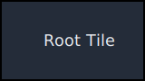
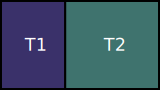
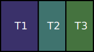

# zland

zland is a wlroots-based compositor based on the concept of mouse-based manual tiling.

### Technical Breakdown

Tiling window managers and compositors like bspwm and Hyprland implement something similar to this, but not the same thing. Pop shell is the closest to what I want that I've come across, but being a GNOME shell extension it has all the problems associated with GNOME and doesn't perform as well as I'd like it to.

Like i3 and sway, zland is a manual tiler. That means that the tiling pattern is not chosen from a set list (dynamic tiling) but is arranged manually. Tiles are arranged in a tree, with the root tile occupying the entire screen and children of a tile occupying horizontal or vertical slices of the parent tile.

|  |  |
| - | - |
| Root tile | Two children of the root tile |

Splitting the root tile in half gives you two tiles with the root tile as their parent.

|  |  |
| - | - |
| T2 split across | T2 split down the middle |

Splitting T2 in half horizontally gives you two tiles with T2 as their parent. However, splitting it vertically gives you another sibling of T2. Repeatedly slicing the root tile vertically gives you more and more children of the root tile, while slicing it vertically, then horizontally repeatedly to make a dwindle pattern gives you more and more levels of heirarchy.

A tile that is occupied by a window cannot have children, since the point of tiling is that no window overlaps any other. Splitting a tile T1 occupied by a window in half will result in the window being assigned to a child of T1, resolving the problem of overlapping windows.

This is in general the way window tiling works. Where window tilers differ is how they manage this tree. For one thing, there's the difference between dynamic and manual tilers. Dynamic tilers have specific rules that govern how tiles are split (example: master and stack, fibonacci spiral, dwindle) while manual tilers allow the user to arrange them however they so choose. Window tilers also differ in the input method used, but almost invariably, window tiling extensions for DEs are mouse-based and standalone tiling window managers / compositors are either entirely keyboard-based or require the keyboard to move windows around (holding the meta key and dragging a window). As said above, Pop shell is my favorite variant of this and is what I'm trying to emulate with this project.

